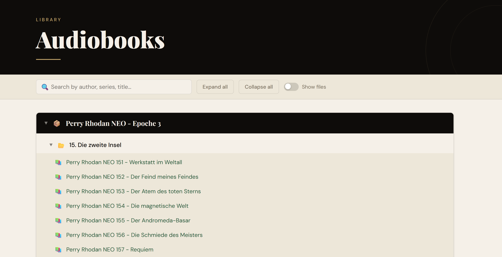

# 📚 library-tree

A zero-dependency Node.js script that scans a local audiobook or e-book library and generates a single, self-contained HTML file — a beautiful, interactive overview you can open in any browser.

No server, no install, no framework. Just Node.js and one command.



## Features

- **Collapsible tree** — authors and series fold cleanly, top-level entries open by default
- **Live search** — filters the entire tree instantly as you type, highlights matches and reveals their ancestors
- **Show files toggle** — switch between a compact folder view (📚 / 📖) and a detailed file list with format tags and file sizes
- **Color-coded entries** — green for audiobooks, blue for e-books, readable on both dark and light backgrounds
- **Fully offline** — the generated HTML file has no runtime dependencies and works without an internet connection (fonts load from Google Fonts if available, but the layout holds without them)

## Supported formats

| Type | Extensions |
|------|-----------|
| Audiobook | `.mp3` `.m4a` `.m4b` `.aac` `.ogg` `.opus` `.flac` `.wav` `.wma` `.aiff` `.aif` `.ape` |
| E-Book | `.epub` `.pdf` `.mobi` `.azw` `.azw3` `.lit` `.djvu` `.fb2` `.cbz` `.cbr` |

## Requirements

[Node.js](https://nodejs.org) — any reasonably modern version. No `npm install` needed.

## Usage

```bash
node library-tree.js "<path-to-your-library>"
```

**Examples:**

```bash
# Windows
node library-tree.js "E:\Audiobooks"

# macOS / Linux
node library-tree.js "/home/user/Books"
```

This creates a file called `<folder-name>.html` in your current working directory. Open it in any browser.

## How it works

The script walks your library directory and classifies each folder as one of two things:

- **Leaf folder** — a folder that directly contains media files. Displayed as 📚 (audiobook) or 📖 (e-book). In the default compact view, only the folder name is shown. Enabling "Show files" reveals the individual files inside.
- **Branch folder** — a folder that contains only other folders (e.g. an author or series grouping). Displayed as a collapsible tree node (📦 / 📂 / 📁).

The entire output is a single `.html` file with all CSS and JavaScript inlined — no external files, no dependencies.
